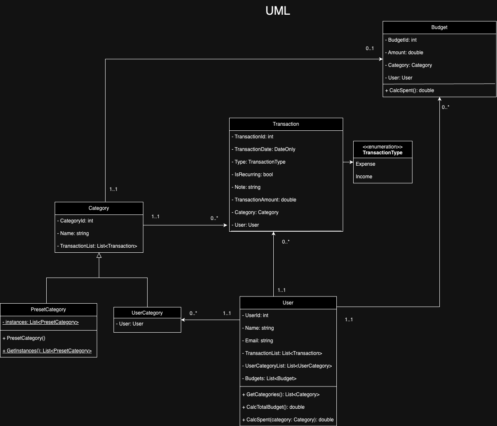

# Budget Tracking App

## Member

**Jin Mizuno:** Project manager, Developer

**Md Forhadul Islam:** Designer

**Wu Jinyong:** Tester

## Design

During the design process, class and object diagrams were created to visually represent the structure and relationships of important components in the application. The classes included in the system are User, Transaction, Budget, Category, Inherited User Category, and Inherited Preset Category. Each class has its own set of properties and methods. Inheritance was employed to establish linkages between the category and the Inherited User Category and Inherited Preset Category.

## Implementation

In implementation, the following points were taken into account while paying attention to maintainability and extensibility

### Design Patterns

#### Singleton Pattern

The Singleton pattern ensures that a class has only one instance and provides a global point of access to it. In this application, the `Logger` and `BudgetApp` classes utilize the Singleton pattern. These classes hold their instances statically and offer access to the unique instance through a `GetInstance()` method, preventing direct instantiation from outside. This pattern is beneficial for maintaining a consistent logging mechanism and managing core functionalities of the application across its entirety.

#### Factory Pattern

The Factory Pattern separates the instantiation logic from the client and allows subclasses to decide what to instantiate. The CategoryFactory class in this case is responsible for generating different types of category objects (PresetCategory and UserCategory). Each method creates a new category object of the requested type, assigns it a unique ID (CategoryId), sets the required information (name and user) and then returns the object. This allows categories to be uniquely identified throughout the application.

#### Repository Pattern (Bridge Pattern)

The Repository pattern introduces an abstraction layer between the data source (e.g., a database) and the business logic layer. It separates data access logic from business logic, allowing for changes in data sources without impacting the business logic. The `Logger` class adopts this pattern, interfacing with log storage through the `ILogRepository` interface, enabling flexible changes in log storage destinations. This facilitates easy switching between different logging methods for development and production environments.

### Inheritance

In managing categories, the application distinguishes between two types: categories created by the user (User Categories) and categories pre-defined by the application (Preset Categories). To efficiently manage these categories, an abstract class named `Category` consolidates common attributes. This class is then inherited by `PresetCategory` and `UserCategory` to cater to their specific needs.

- **UserCategory** needs to be linked with a `User`, hence an additional `User` attribute is incorporated to establish a clear relationship between the user and their categories.
- **PresetCategory** requires the instances created to be shared across all users of the application. To fulfill this requirement, static attributes within the PresetCategory class manage the instances, ensuring application-wide accessibility.

### Delegation

The `CalcSpent` method in the `User` class calculates spending for a user in a specific category, based on the category and transaction list. Here, a `User` object calculates expenditure through its transaction list for a given category, bearing the responsibility of deriving expenditures by category. This can be considered delegation in terms of distributing responsibilities among objects.

### Special Notes

- **Static Instance Management in PresetCategory**: The `PresetCategory` class manages all instances using a static list to track created instances. This facilitates easy access to preset category instances across the application while tracking each new instance as it's created.
- **Use Cases as Service Layer**: As the program expanded and the `Program.cs` file became lengthy and cluttered, files were segmented according to domain areas and stored within the `Services` directory. This reorganization improved code structure and manageability.
- **Defining Methods within Models**: Operations tied to a specific model and called multiple times within the service layer are defined as methods within the model itself. For example, the operation to retrieve all categories of a user is defined as the `GetCategories` method within the `User` model. This approach enhances code reusability and organization.
- **Transaction Management**: Transactions are categorized into two types: Expenses and Income. These categories are managed through an Enum named `TransactionType`, with attributes defined as `Type` within transactions. This distinction clarifies transaction types, simplifying their management.

## Testing

### Allow a user to see a list of recent transactions

- **Positive Test:** Verify that the recent transactions list is displayed correctly.

- **Negative Test:** Check the error warning when entering invalid option.

### Allow a user to enter a new transaction

- **Positive Test 1:** Add a new transaction with Date, type (income/expense), recurring, note, amount, and category.

- **Positive Test 2:** Edit a note and specify whether it is a recurring.

- **Negative Test:** Attempt to add a transaction with missing information.

### Allow the user to edit/delete transactions

- **Positive Test:** Edit an existing transaction and verify the changes.

- **Negative Test:** Attempt to delete a non-existent transaction.

### Allow the user to see a list of categories

- **Positive Test1:** Verify that the preset categories are displayed.

- **Positive Test2:** An advanced application will allow the user to add new categories.

- **Negative Test:** Check the error handling when entering invalid categories option.

### Allow the user to enter a budget

- **Positive Test:** Set budgets for each category and verify the changes.

- **Negative Test:** Attempt to enter invalid budget amounts.

### Allow the user to track their progress against their budget

- **Positive Test:** Check if spending is accurately tracked against the budget for each category and overall.

### Test Results

All test cases passed successfully without any errors or unexpected behaviour.

### Conclusion

The budget application has been thoroughly tested, and all requirements have been successfully implemented. The application provides users with comprehensive features for managing their finances effectively.

## Contribution

### Jin Mizuno

In my role as Project Manager, I was tasked with the strategic oversight of our project's lifecycle, encompassing the establishment of clear team objectives and milestones to guide our progress and ensure alignment with our goals. A key aspect of my duties involved documenting the proceedings of each meeting. After every team meeting, I diligently wrote minutes, capturing the essence of our discussions, decisions made, and action items assigned.

In my role as Developer, my contribution focused on the practical application of design patterns and principles to enhance the architecture and functionality of the software. I took charge of implementing the classes originally designed by Forhad, introducing minor modifications to the design where necessary to optimize maintainability. Specifically, I incorporated the Singleton design pattern into the Logger class to ensure a single instance of the logger is used throughout the application, enhancing consistency in logging mechanisms.

Additionally, I applied the Factory design pattern to the Category class to consolidate the logic of creating instances of the PresetCategory and UserCategory classes, which inherit from the Category class, in one place and track CategoryId. To further decouple the abstraction from its implementation, I integrated the Bridge design pattern into the Logger class, providing a more scalable and maintainable structure that can accommodate future changes with minimal impact on existing code.

I also utilized inheritance with the Category class to establish a hierarchical relationship between different types of categories, promoting code reuse and simplifying the modification process. Lastly, I implemented delegation in the User class, offloading specific tasks to other classes while maintaining a clear separation of responsibilities. This approach not only simplifies the User class but also enhances the overall design by promoting loose coupling and high cohesion.
