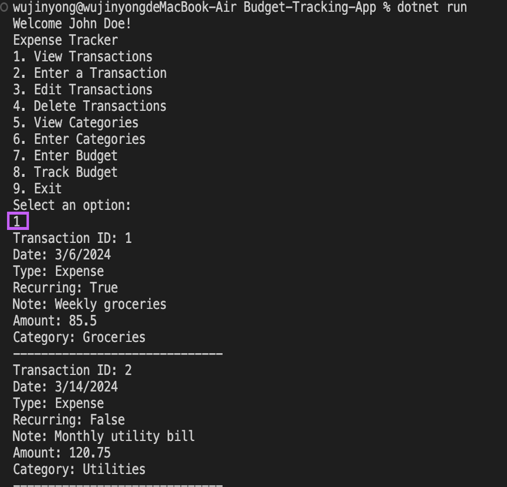
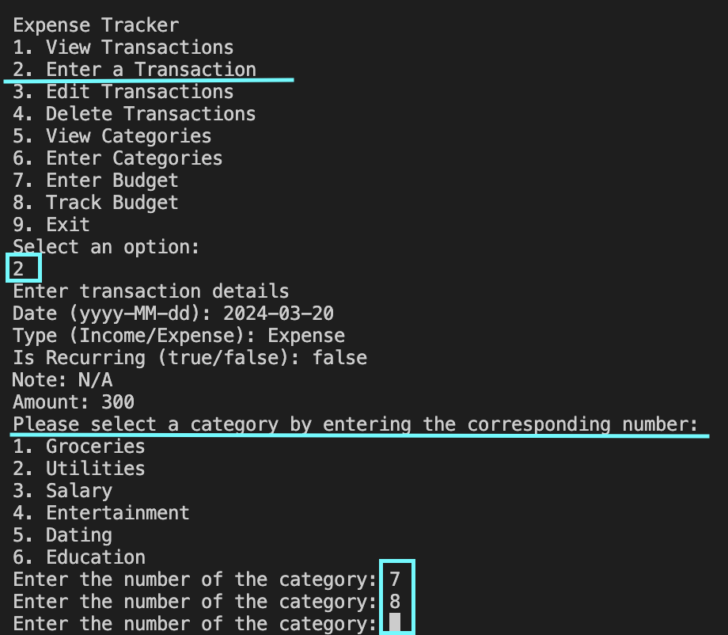
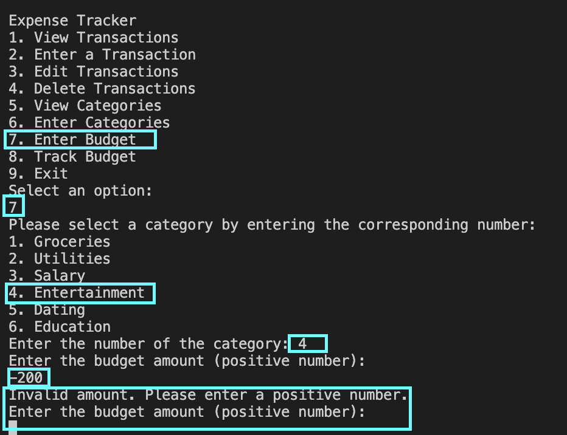

# Budget Tracking App

## Member

**Jin Mizuno:** Project manager, Developer

**Md Forhadul Islam:** Designer

**Wu Jinyong:** Tester

## Design

### UML Class Diagram


### Description

During the design process, class and object diagrams were created to visually represent the structure and relationships of important components in the application. The classes included in the system are User, Transaction, Budget, Category, Inherited User Category, and Inherited Preset Category. Each class has its own set of properties and methods. Inheritance was employed to establish linkages between the category and the Inherited User Category and Inherited Preset Category. The UML class diagram with multiplicities and relationships depicts the structural organization of classes within the system, emphasizing associations, dependencies, and the cardinality of relationships between classes. This diagram provides a detailed blueprint of how classes interact and collaborate to fulfill system functionalities, guiding the design and development process.

### Key Components

#### Classes

User: Represents users of the system, featuring attributes like userId, username, email.

Transaction: Represents financial transactions made by users, with attributes such as transactionId, transaction date, type, note and transaction amount.

Budget: Represents budgets set by users, including attributes like budgetId, amount, category and user.

Category: Represents transaction or budget categories, containing attributes like categoryId, name and transaction list.

Inherited User Category: Represents categories inherited by users, inheriting properties from the Category class.

Inherited Preset Category: Represents categories inherited by preset categories, also inheriting properties from the Category class.

#### Relationships

User-Transaction (One-to-Many): Indicates that a user can have multiple transactions, while each transaction belongs to only one user. This relationship is depicted with a one-to-many association and multiplicity notation (1..*).

User-Budget (One-to-Many): Represents that a user can have multiple budgets, with each budget belonging to a single user. Shown as a one-to-many association with multiplicity notation (1..*).

User-Category (One-to-Many): Illustrates that a user can have multiple categories, each category being associated with only one user. Presented as a one-to-many association with multiplicity notation (0..*).

Category-Transaction (One-to-Many): Indicates that a category can be associated with multiple transactions, while each transaction is associated with only one category. Shown as a one-to-many association with multiplicity notation (1..*).

Budget-Category (One-to-One): Represents a one-to-one relationship between budgets and categories, indicating that each budget has only one category associated with it. Displayed as a one-to-one association with multiplicity notation (1..1).

#### Purpose

The UML class diagram with multiplicities and relationships serves as a comprehensive guide to understanding the structure and interactions of classes within the system. It enables developers, testers, and stakeholders to visualize how classes are connected and how data flows between them. This diagram aids in designing, implementing, and maintaining the system by providing a clear representation of class relationships and dependencies.

#### Usage

Design Phase: Used during the initial design phase to plan and model the system's architecture, ensuring that classes are properly organized and relationships are well-defined.

Development Phase: Serves as a reference for developers during the implementation of the system, guiding the coding process and ensuring consistency with the design specifications.

Documentation: Provides valuable documentation for the system, helping to communicate the system's structure and functionality to team members, stakeholders, and future developers.

Testing and Validation: Supports testing and validation efforts by providing insights into how data flows between classes and how different components of the system interact with each other.

In summary, the UML class diagram with multiplicities and relationships is an essential tool for understanding, designing, and communicating the structural aspects of a system, facilitating effective collaboration and development efforts.

### UML Object Diagram


#### Description

The UML object diagram for your project illustrates specific instances of classes and their relationships within the system. It provides a snapshot of the system's state at a particular point in time, showcasing concrete examples of objects and their connections. This diagram aids in understanding how classes interact and collaborate to fulfil system requirements.

#### Key Components

User Instance: Represents an instance of the User class with attributes such as user Id, username and email populated with specific values.

Transaction Instance: Illustrates an instance of the Transaction class with attributes like transaction Id, date, type, recurring, note, amount and category populated with relevant data.

Budget Instance: Depicts an instance of the Budget class with attributes including category ID, budget amount, spent and remaining containing specific values.

Category Instances: Represent instances of the Category class, each with categoryId, name, allocated budget and balance attributes reflecting concrete category examples.

Relationships: Connections between instances, indicating associations, dependencies, and inheritance relationships as defined in the class diagram.

#### Purpose

The UML object diagram offers insight into the current state of the system by showcasing actual instances of classes and their relationships. It aids in validating the design, testing functionalities, and communicating specific scenarios or use cases with stakeholders.

#### Usage

During the analysis phase to validate the system's design and ensure it aligns with requirements.

For testing and validation purposes to verify object interactions and behaviours. As a communication tool to discuss and clarify specific system states or scenarios with stakeholders.

## Implementation

In implementation, the following points were taken into account while paying attention to maintainability and extensibility

### Design Patterns

#### Singleton Pattern

The Singleton pattern ensures that a class has only one instance and provides a global point of access to it. In this application, the `Logger` and `BudgetApp` classes utilize the Singleton pattern. These classes hold their instances statically and offer access to the unique instance through a `GetInstance()` method, preventing direct instantiation from outside. This pattern is beneficial for maintaining a consistent logging mechanism and managing core functionalities of the application across its entirety.


```C#
public class Logger
{
    private static Logger instance;
    private static readonly object lockObject = new object();
    private ILogRepository logRepository;

    private Logger() { }

    public static Logger GetInstance()
    {
        if (instance == null)
        {
            lock (lockObject)
            {
                if (instance == null)
                {
                    instance = new Logger();
                }
            }
        }
        return instance;
    }

    //...
}
```

#### Factory Pattern

The Factory Pattern separates the instantiation logic from the client and allows subclasses to decide what to instantiate. The CategoryFactory class in this case is responsible for generating different types of category objects (PresetCategory and UserCategory). Each method creates a new category object of the requested type, assigns it a unique ID (CategoryId), sets the required information (name and user) and then returns the object. This allows categories to be uniquely identified throughout the application.


```C#
public class CategoryFactory
{
    private static int nextCategoryId = 1;

    public static PresetCategory CreatePresetCategory(string name)
    {
        var category = new PresetCategory
        {
            CategoryId = nextCategoryId++,
            Name = name,
        };

        return category;
    }

    public static UserCategory CreateUserCategory(string name, User user)
    {
        var category = new UserCategory
        {
            CategoryId = nextCategoryId++,
            Name = name,
            User = user
        };

        return category;
    }
}
```

#### Repository Pattern (Bridge Pattern)

The Repository pattern introduces an abstraction layer between the data source (e.g., a database) and the business logic layer. It separates data access logic from business logic, allowing for changes in data sources without impacting the business logic. The `Logger` class adopts this pattern, interfacing with log storage through the `ILogRepository` interface, enabling flexible changes in log storage destinations. This facilitates easy switching between different logging methods for development and production environments.


```C#
public interface ILogRepository
{
    void Log(string message);
}

public class Logger
{
    // ...

    private ILogRepository logRepository;

    // ...

    public void SetLogRepository(ILogRepository repository)
    {
        logRepository = repository;
    }

    public void Warn(string message)
    {
        logRepository.Log("WARN: " + message);
    }

    // ...
}

public class ConsoleRepository : ILogRepository
{
    public void Log(string message)
    {
        Console.WriteLine(message);
    }
}

public class FlatFileRepository : ILogRepository
{
    private readonly string filePath = "logs/log.txt";

    public void Log(string message)
    {
        using (StreamWriter streamWriter = new StreamWriter(filePath, true))
        {
            streamWriter.WriteLine($"{DateTime.Now}: {message}");
        }
    }
}
```

```C#
class Program
{
    static void Main(string[] args)
    {
        Logger logger = Logger.GetInstance();
        string environment = Environment.GetEnvironmentVariable("APP_ENVIRONMENT") ?? "development";

        if (environment == "development")
        {
            // Use FlatFileRepository in development
            logger.SetLogRepository(new FlatFileRepository());
            logger.Info("Logging to console in development environment.");
        }
        else
        {
            // Use DatabaseRepository in other environments
            logger.SetLogRepository(new DatabaseRepository());
            logger.Info("Logging to database in non-development environment.");
        }

        // ...
    }
}
```

### Inheritance

In managing categories, the application distinguishes between two types: categories created by the user (User Categories) and categories pre-defined by the application (Preset Categories). To efficiently manage these categories, an abstract class named `Category` consolidates common attributes. This class is then inherited by `PresetCategory` and `UserCategory` to cater to their specific needs.

- **UserCategory** needs to be linked with a `User`, hence an additional `User` attribute is incorporated to establish a clear relationship between the user and their categories.
- **PresetCategory** requires the instances created to be shared across all users of the application. To fulfill this requirement, static attributes within the PresetCategory class manage the instances, ensuring application-wide accessibility.

```C#
abstract public class Category
{
    public int CategoryId { get; set; }
    public required string Name { get; set; }
    public List<Transaction> TransactionList { get; set; } = new List<Transaction>();
}

public class UserCategory : Category
{
    public required User User { get; set; }
}

public class PresetCategory : Category
{
    private static List<PresetCategory> instances = new List<PresetCategory>();

    public PresetCategory()
    {
        instances.Add(this);
    }

    public static List<PresetCategory> GetInstances()
    {
        return instances;
    }
}
```

### Delegation

The `CalcSpent` method in the `User` class calculates spending for a user in a specific category, based on the category and transaction list. Here, a `User` object calculates expenditure through its transaction list for a given category, bearing the responsibility of deriving expenditures by category. This can be considered delegation in terms of distributing responsibilities among objects.

```C#
public class User
{
    // ...

    public double CalcSpent(Category category)
    {
        return TransactionList.Where(t => t.Category == category).Sum(t => t.TransactionAmount);
    }
}

public class Budget
{
    // ...

    public double CalcSpent()
    {
        return User.CalcSpent(Category);
    }
}
```

### Special Notes

- **Static Instance Management in PresetCategory**: The `PresetCategory` class manages all instances using a static list to track created instances. This facilitates easy access to preset category instances across the application while tracking each new instance as it's created.

```C#
public class PresetCategory : Category
{
    private static List<PresetCategory> instances = new List<PresetCategory>();

    public PresetCategory()
    {
        instances.Add(this);
    }

    public static List<PresetCategory> GetInstances()
    {
        return instances;
    }
}
```

- **Use Cases as Service Layer**: As the program expanded and the `Program.cs` file became lengthy and cluttered, files were segmented according to domain areas and stored within the `Services` directory. This reorganization improved code structure and manageability.

```C#
public class BudgetApp
{
    // ...

    public void Run()
    {
        // ...

        bool exit = false;
        while (!exit)
        {
            DisplayMainMenu();
            exit = ProcessMainMenuOption(user);
        }
        logger.Info("BudgetApp session ended.");
    }

    private void DisplayMainMenu()
    {
        Console.WriteLine("Expense Tracker");
        Console.WriteLine("1. View Transactions");
        Console.WriteLine("2. Enter a Transaction");
        // ...
    }

    private bool ProcessMainMenuOption(User user)
    {
        Console.WriteLine();
        switch (Console.ReadLine())
        {
            case "1":
                TransactionService.ViewTransactions(user);
                break;
            case "2":
                TransactionService.EnterTransaction(user);
                break;
            // ...
        }
        Console.WriteLine();
        return false;
    }
}
```

- **Defining Methods within Models**: Operations tied to a specific model and called multiple times within the service layer are defined as methods within the model itself. For example, the operation to retrieve all categories of a user is defined as the `GetCategories` method within the `User` model. This approach enhances code reusability and organization.

```C#
public class User
{
    // ...
    public List<Category> GetCategories()
    {
        var presetCategories = PresetCategory.GetInstances();
        var userCategories = UserCategoryList;
        return presetCategories.Cast<Category>().Concat(userCategories.Cast<Category>()).ToList();
    }
    // ...
}
```

- **Transaction Management**: Transactions are categorized into two types: Expenses and Income. These categories are managed through an Enum named `TransactionType`, with attributes defined as `Type` within transactions. This distinction clarifies transaction types, simplifying their management.

```C#
public enum TransactionType
{
    Income,
    Expense
}
```

## Testing

### Allow a user to see a list of recent transactions

- **Positive Test:** Verify that the recent transactions list is displayed correctly.




- **Negative Test:** Check the error warning when entering invalid option.


### Allow a user to enter a new transaction

- **Positive Test 1:** Add a new transaction with Date, type (income/expense), recurring, note, amount, and category.


- **Positive Test 2:** Edit a note and specify whether it is a recurring.


- **Negative Test:** Attempt to add a transaction with missing information.


### Allow the user to edit/delete transactions

- **Positive Test:** Edit an existing transaction and verify the changes.


- **Negative Test:** Attempt to delete a non-existent transaction.


### Allow the user to see a list of categories

- **Positive Test1:** Verify that the preset categories are displayed.


- **Positive Test2:** An advanced application will allow the user to add new categories.


- **Negative Test:** Check the error handling when entering invalid categories option.



### Allow the user to enter a budget

- **Positive Test:** Set budgets for each category and verify the changes.


- **Negative Test:** Attempt to enter invalid budget amounts.




### Allow the user to track their progress against their budget

- **Positive Test:** Check if spending is accurately tracked against the budget for each category and overall.


### Test Results

All test cases passed successfully without any errors or unexpected behaviour.

### Conclusion

The budget application has been thoroughly tested, and all requirements have been successfully implemented. The application provides users with comprehensive features for managing their finances effectively.

## Contribution

### Jin Mizuno

In my role as Project Manager, I was tasked with the strategic oversight of our project's lifecycle, encompassing the establishment of clear team objectives and milestones to guide our progress and ensure alignment with our goals. A key aspect of my duties involved documenting the proceedings of each meeting. After every team meeting, I diligently wrote minutes, capturing the essence of our discussions, decisions made, and action items assigned.

In my role as Developer, my contribution focused on the practical application of design patterns and principles to enhance the architecture and functionality of the software. I took charge of implementing the classes originally designed by Forhad, introducing minor modifications to the design where necessary to optimize maintainability. Specifically, I incorporated the Singleton design pattern into the Logger class to ensure a single instance of the logger is used throughout the application, enhancing consistency in logging mechanisms.

Additionally, I applied the Factory design pattern to the Category class to consolidate the logic of creating instances of the PresetCategory and UserCategory classes, which inherit from the Category class, in one place and track CategoryId. To further decouple the abstraction from its implementation, I integrated the Bridge design pattern into the Logger class, providing a more scalable and maintainable structure that can accommodate future changes with minimal impact on existing code.

I also utilized inheritance with the Category class to establish a hierarchical relationship between different types of categories, promoting code reuse and simplifying the modification process. Lastly, I implemented delegation in the User class, offloading specific tasks to other classes while maintaining a clear separation of responsibilities. This approach not only simplifies the User class but also enhances the overall design by promoting loose coupling and high cohesion.

## Appendix

1. Github Link: https://github.com/MizunoJin/Budget-Tracking-App
